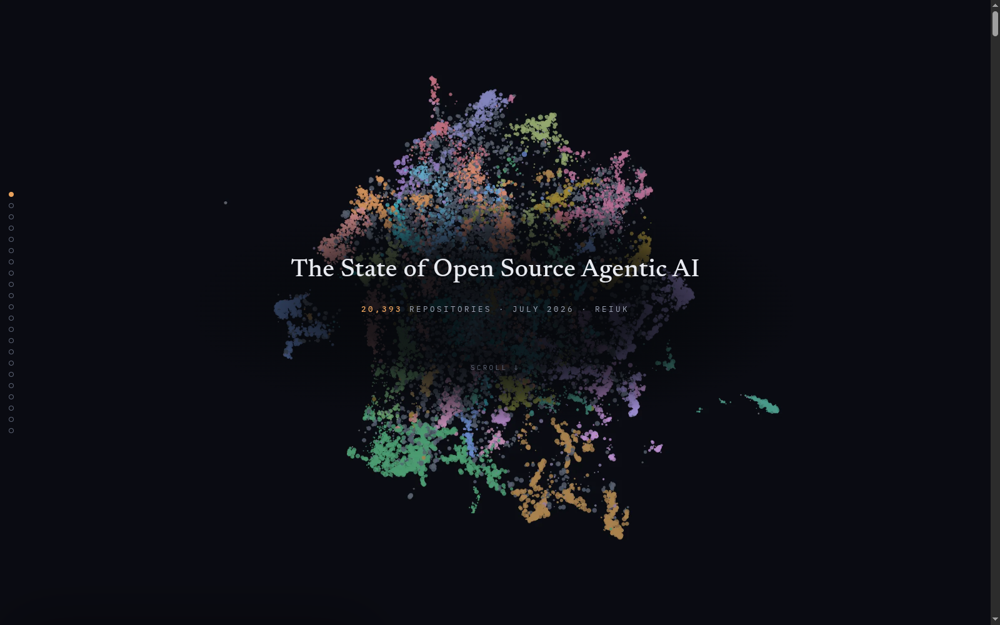

# The State of Open Source Agentic AI · July 2026

An interactive map and story of **20,393 open-source agentic-AI
repositories**, every one fetched and read (README, file tree, source
files) and classified from its actual code, not its claims.

**Live: [stateofagenticai.reiuk.co.uk](https://stateofagenticai.reiuk.co.uk)**



Two modes, one WebGL scene:

- **The story**, a 22-step scroll narrative: the authorship flip (two-thirds
  of 2026's repos are AI-assisted builds), the slop stratum and its 63
  genres, the star band where deceptive presentation peaks, the harness explosion,
  the problems the ecosystem fixates on, the redundancy census, mortality, and the
  drive-by cohort no dashboard metric can see yet.
- **The explorer**, the full map: pan/zoom, color by region / cluster /
  construction / pulse / language / problem / weight, facet filters, search
  (opt-in full-description search), and a card for every repository with its
  capability description, problem statement, and nearest neighbors.

## Run locally

```
python3 -m http.server 8931
# open http://localhost:8931/
```

Any static file server works (`file://` does not, since data loads via fetch).
Deploying is copying this directory to any static host; there is no server
code and no external request (fonts and deck.gl are vendored).

## The data

The released dataset is the site payload under `data/`:

- `data/core.json` holds all 20,393 repositories, columnar: name, owner,
  2-D map position, stars, created/last-commit dates, language, license,
  construction class (human-built / AI-assisted / slop), kind, layer, pulse,
  git-tree file count, and region / micro-cluster / problem-cluster
  assignments (with label tables).
- `data/detail/*.json` holds each repository's capability description (what
  it actually builds), problem statement (why it exists), and nearest
  neighbors, computed in the full embedding space.
- `data/sets.json` holds the highlight sets used by the story (named-agent
  mentions, near-duplicates, one-of-a-kind).

Metadata is a **2026-07-01 snapshot**. The internal per-repo corpus (raw
readings, full classification cards, embedding matrices) is not published;
see `paper/` for how every published number derives from it.

## Method, in one paragraph

Seven gathering passes (curated lists, topic/code searches, ecosystem
sweeps, dependency and contributor network hops, recency passes) through a
deliberate lens: coding agents, agent infrastructure, the tools agents
wield. A census of a *chosen territory*, not of all AI open source; 75.2% of
repos entered through a single discovery path, and the page says so. Every
repository's README (≤6k chars), file tree, and one or two source files were
then read by a frontier model against a fixed rubric and classified;
descriptions were embedded and clustered bottom-up into 178 capability
clusters, 25 named regions, and a separate 120-cluster problem lens. Error
bars are measured and stated in-page: the slop boundary agrees with a blind
second reading 85% of the time and errs one-directionally; the human ↔
AI-assisted boundary is soft (~67% exact) and drawn only with an error band.
Full methodology in the site's in-page appendix.

## Provenance (`paper/`)

- `findings-memo.md`: the findings memo (F1–F32), including the naming and
  fairness rulings the publication follows, reproduced from the internal
  repository with two small redactions the memo's own rulings require.
- `queries.py` → `computed.json` and `queries_emb.py` → `computed-emb.json`:
  the audited query harnesses and their committed outputs. Every figure on
  the page is copied from these outputs and diffed against them in QA. The
  scripts run against the internal corpus files, which are not published;
  the outputs are committed here so every number is inspectable.
- `queries.md`: the claim → query mapping for every published number.

## Honesty notes

- **This is an AI-assisted work.** The repository readings and
  classifications were produced by frontier language models against fixed,
  audited rubrics; the site and analysis were built with AI coding agents.
  Classification judgment calls carry the measured error bars above.
- **"Slop" is a stratum, not an accusation.** It means *no substantive
  engineered artifact behind the claims*, which sweeps coursework and prompt
  collections in with actual scams; the genre labels distinguish them, and
  individual repositories carry only a genre plus an explicit
  triage-not-verdict caveat.
- **No individual repository or owner is named in editorial prose** for
  slop, star-inflation, or similar findings; patterns are reported with
  counts. The map itself carries only public GitHub metadata.

## License

- **Code** (site, styles, markup, and the two analysis scripts,
  `paper/queries*.py`): [MIT](LICENSE).
- **Data & findings** (`data/` and the rest of `paper/`):
  [CC BY-NC-ND 4.0](LICENSE-DATA.md). View, share, and cite with
  attribution, non-commercially; no modified redistributions or commercial
  use without permission.
- Vendored third parties keep their own licenses: deck.gl (MIT); Inter,
  IBM Plex Mono, and Newsreader (SIL OFL 1.1).

---

Data snapshot 2026-07-01. Type: Newsreader, Inter, IBM Plex Mono.
Built by [REI](https://reiuk.co.uk). Soli Deo Gloria.
